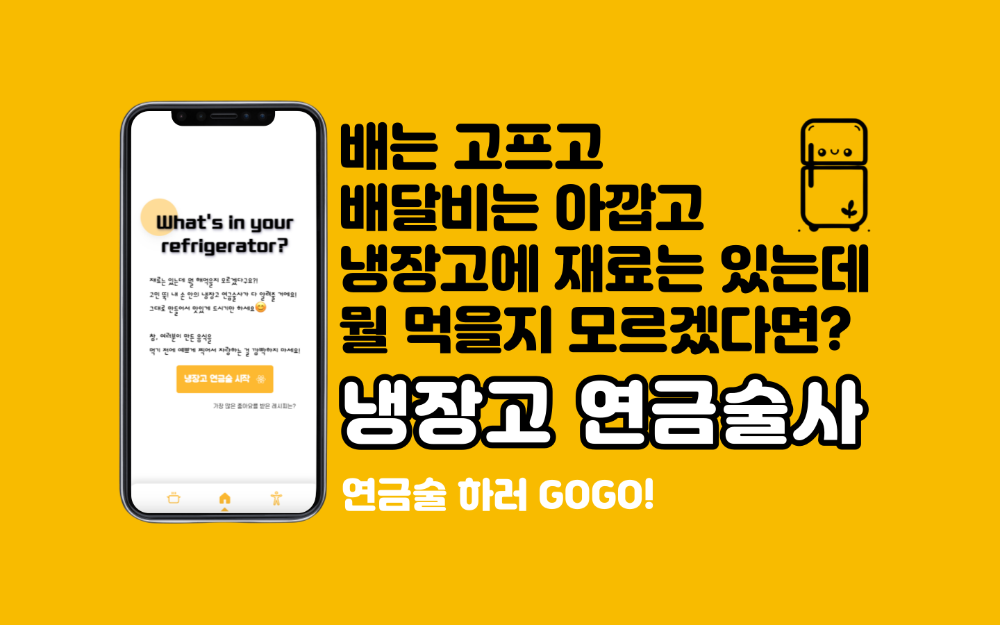
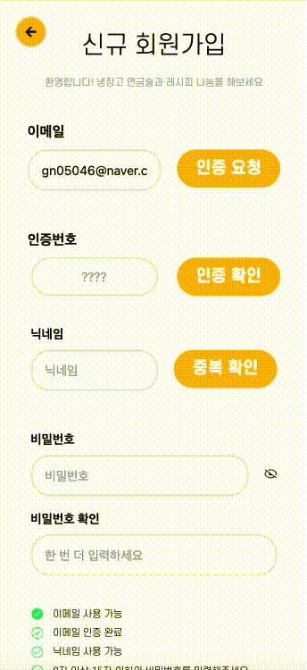
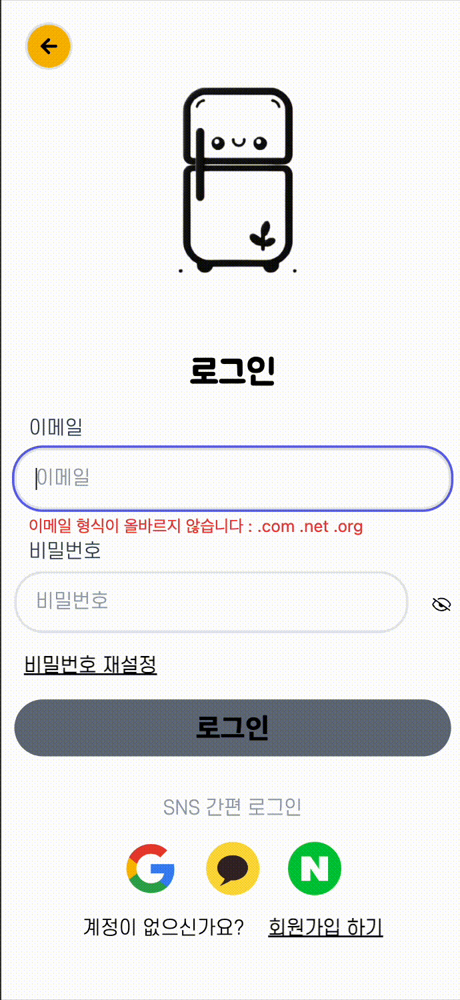
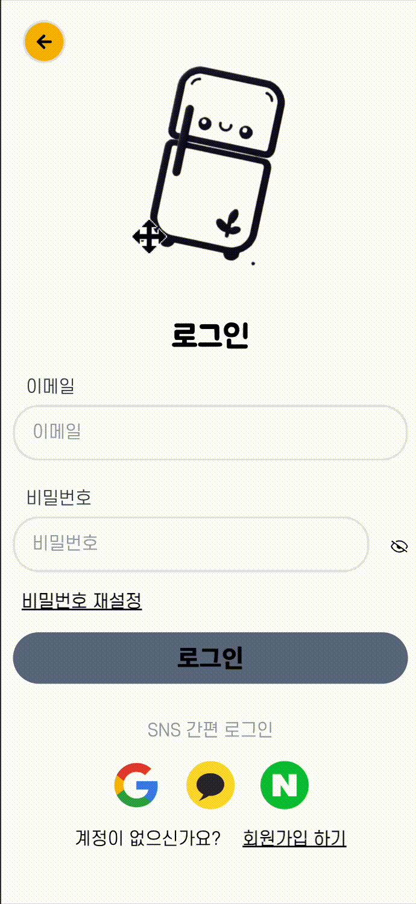
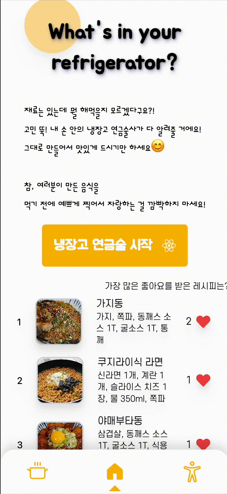
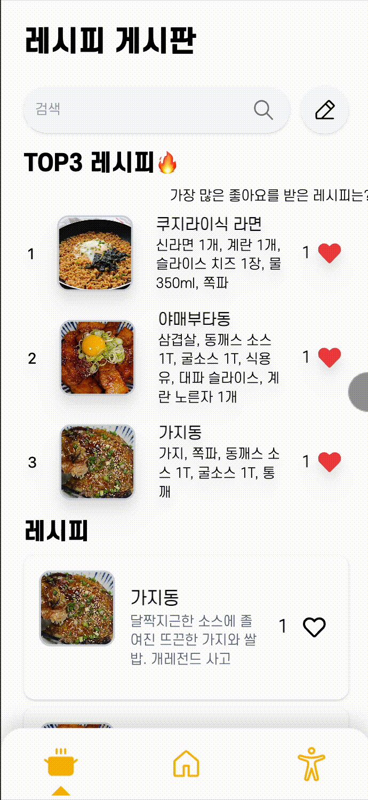
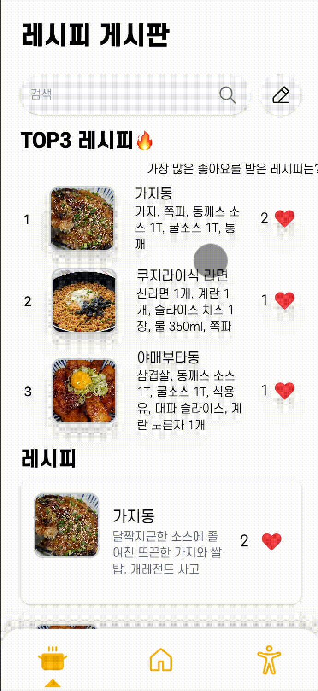

# 🧙 냉장고 연금술사

## 📋 목차

- [🔗 접속 링크](#🔗-접속-링크)
- [📝 기간](#📝-기간)
- [✅ 사용한 도구들](#✅-사용한-도구들)
- [🧑‍🤝‍🧑 팀원 & 역할](#🧑‍🤝‍🧑-팀원--역할)
- [🧚🏻 냉장고 연금술사 사용법](#🧚🏻-냉장고-연금술사-사용법)
- [🥞 프로젝트 회고록](#🥞-프로젝트-회고록)

### 👉 서비스 소개

마땅히 먹고 싶은 건 없는데 배달비는 비싸고, 냉장고에 남은 재료들은 있는데
뭘 만들면 좋을지 아이디어는 안 떠오르고...
다들 자주 겪는 고민이 아닐까요? 그런 고민을 해결하기 위해서 레시피를 만들어 줄 수 있는
해결사가 있으면 좋겠다고 생각했어요! 그래서 저희는 냉장고 연금술사라는 해결사를 만들었어요!

연금술을 사용해서 레시피를 만들어 내고, 커뮤니티에서 사람들과 레시피를 서로 공유 해주세요!
인기만점 랭킹 Top3 게시물은 명예의 전당에도 오른답니다😀

## 🔗 접속 링크

http://배포후도메인

## 📝 기간

- 기능 구현 및 테스트 : 2024.01.31 ~ 2024.04.31
- 이후 버그 발견시 상시 디버깅
- 배포 : 2024.

## 🎙️ 커뮤니케이션 방식

- 매주 토요일 오프라인 회의 (3시간)
- 디스코드에 서버를 만들어 자료나 전체 전달 사항 공유
- 온오프라인 회의로 의견 전달이나 문제점 설명
- 같은 파트를 구현하는 백-프론트 팀원간 상시 통화와 화면 공유를 통한 기능 구현
- Github 브랜치의 코드 pull과 push를 통한 지속적인 동기화

## ✅ 사용한 도구들

  
IDE

  
  

 

  
디자인

  

 

  
협업

  
  
  
  

 

  
FE Stack

  
  
  
  
  
  
  

 

  
BE Stack

  
  
  

 

  
APIs

  

 

  
배포

  
  

## ⚠️ 프로젝트에 도입된 기술

### 프론트엔드

### 👉 React.js + Tailwindcss

- React.js

  - 빠른 개발과 기능 구현이 가능하고 컴포넌트별로 개발하기 때문에 후에 리팩토링 및 유지 보수가 용이하여 리액트를 사용했습니다.
  - 냉장고 연금술사는 CSR 방식의 렌더링을 하는 것이 적합하다고 생각했습니다. CSR은 초기 로딩시간이 길 수 있지만 서비스 접속시 초기화면을 보는 데에는 오래 걸리지 않습니다. 또한 서비스의 메인 활동은 레시피 연금술이며 이는 유저가 직접 재료를 입력하고 생성하는 상호작용이 주된 동작이기 때문에 SSR보다는 CSR이 더 적합하다고 생각했습니다.

- Tailwindcss
  - 프론트 팀이 공통적으로 사용해 본 CSS 라이브러리가 tailwindcss였기에 러닝커브 회피 및 개발기간 단축을 위해 사용했습니다.
  - xml 코드의 가독성은 복잡해지나 즉각적인 스타일링 수정이 가능한 점이 장점입니다.

### 👉 React Query

- 리액트 쿼리는 useEffect를 사용하여 데이터를 캐시해뒀다가

### 👉 useContext

- 우선 Redux를 사용하기 위한 개발 경험이 충분하지 않았습니다. 그래서 좀 더 익숙하며 프로젝트에 들어가는 학습 비용을 줄일 수 있는 방법을 선택했습니다.
- 또한, Redux는 대규모 애플리케이션의 리소스와 전역 상태 관리에 효율적인 것으로 알고 있습니다. 냉장고 연금술사의 경우 유저의 회원가입, 인증번호 확인, 로그인 등의 API를 호출하는 함수를 제외하면 컴포넌트 트리 전체에서 전역으로 공유될 상태가 없어 리액트에서 기본적으로 제공하는 useContext로 전역 상태를 관리했습니다.

### 👉 Prettier

- VSC의 강력한 코드 포맷팅 확장프로그램인 Prettier를 사용하여 코드 스타일과 가독성을 효율적으로 관리했습니다.

### 백엔드

### 👉 JPA

- sql을 직접적으로 사용하지 않아 가독성이 좋고 코드량이 줄어들어 유지보수에 좋으며 객체지향의 장점을 극대화 할 수 있으며, 캐시 기능을 사용하기에
  높은 성능을 낼 수 있습니다.
- 다른 애플리케이션 서버 환경에서도 호환성을 보장한다는 장점이 있습니다.

### 👉 JWT

- JWT는 쿠키 및 세션에 비해 필요한 모든 정보를 자체적으로 포함하여 별도의 상태 저장이 필요 없습니다.
  서버에있는 Secret-Key를 이용하여 토큰을 만들기에 상대적으로 안정합니다.
  Access 토큰이 만료될 시 Refresh 토큰을 이용하여 Access 토큰을 재발급하여 사용자는 유효기간이 지나도 재로그인을 하지 않고 서비스를 계속 이용 할 수 있게 했습니다.

  Refresh 토큰이 만료 될 시 재로그인 후 토큰들을 재발급하도록 하였습니다. 하지만 jwt.io에서 토큰을 입력하면 디코딩하여 다양한 정보를 볼 수 있기에 필요한 정보만 기입하였습니다.

  현재 트렌드에 맞게 많이 사용하는 기술을 도입해보았습니다.

- 보안 강화 조치도 하였습니다. 사용자가 로그아웃을 하면 클라이언트에서는 캐시에 내장된 JWT를 삭제하면 되지만 서버에서는 이를 무력화 할 방법이 없습니다. 그래서 BlackList라는 것을 만들어서 로그아웃 시 Access 토큰을 Redis에 등록을 합니다.

  만약 타인이 로그아웃 한 사용자의 Access 토큰을 이용하여 악용을 할 시 BlackList에 저장되있는 토큰이라면 서비스 사용을 할 수 없게 조치하였습니다.
  또한 로그아웃 시 Refresh 토큰을 Redis에서 삭제를 합니다.
  만약 Refresh 토큰을 탈취하여 Access 토큰을 재발급 받을 시 해당 Refresh 토큰에 대한 정보가 없기에 Access 토큰을 재발급을 하지 못하도록 조치하였습니다.
  그래서 사용자는 재로그인 시 Access 토큰, Refresh 토큰을 재발급하여 사용합니다.

### 👉 OAuth2.0

- Resource Server(구글, 카카오, 네이버)의 ID, PW를 이용해서 간편 로그인을 구현했습니다.
  로그인 후 추가 정보를 기입하는 페이지로 리디렉션하지 않고 유저에게 좀 더 편안한 UX 제공을 위해 바로 로그인 되도록 만들었습니다.

  저희 서비스에서는 Resource Server로부터 이메일과 프로필 이미지를 가져옵니다. 마이페이지에서 프로필을 확인하면 SNS의 프로필 이미지와 동일한 이미지를 사용하는 것을 확인할 수 있습니다.

- _사용자가 서비스 자체 회원가입에서 이메일 인증 후 회원가입을 하는데 이때 소셜로그인의 이메일과 충돌 나지 않는가?_ 라는 의문이 들 수 있습니다.
  그래서 socialType이라는 필드를 이용해서 SNS 간편 로그인인지 자체 회원가입인지 구별을 하기 때문에 DB에서 충돌이 발생하지 않으며, 자체 회원가입을 한 사용자도 SNS 간편 로그인을 사용하면 새로운 계정으로 이용할 수 있습니다.

### 👉 Redis

- 회원가입 시 이메일 인증을 하는데 서버에서 인증번호를 발급하면 저장소에 해당 인증번호를 저장하고 사용자가 입력한 인증번호와 발급한 인증번호를 비교합니다. 인증번호를 프론트로 넘겨주면 보안상 위험하기에 서버에서 저장하고있어야 합니다.

  RDB에 저장을 하면 캐시보다 검색 속도도 느리며 데이터를 찾았다 할지라도 인증에 성공하면 DB에 내장된 인증번호 데이터는 쓸모가 없어집니다. 이를 직접 지워주기에는 비효율적이라고 판단하여 Redis의 TTL 기능을 이용하여 특정 시간이 지난 후 데이터가 자동 소멸이 되도록하였습니다.

- 로그인 후 사용자 인증을 확인하기 위해 JWT 토큰을 발급합니다. 엑세스 토큰이 만료되면 리프레시 토큰으로 엑세스 토큰을 재발급을 하는데 RDB(관계형 데이터베이스)는 상대적으로 I/O(입출력)연산이 느립니다. 사용자가 로그아웃할 때 JWT 자체는 클라이언트에서 삭제되지만, 서버 측에서 해당 사용자의 JWT를 더 이상 유효하지 않도록 따로 처리할 필요가 있습니다.

  TTL=(유효시간-경과시간)만큼 설정하여, 재발급하기 전 사용하던 JWT 토큰들을 자동으로 소멸하고 토큰들을 관리하기 효율적입니다. 그래서 Redis를 사용하여 토큰 목록도 관리하였고, 서버는 인증을 위해 들어오는 모든 토큰을 이 목록과 대조하여 검증할 수 있었습니다. Redis의 빠른 데이터 액세스는 JWT 검증 과정을 빠르게 만들어 주었습니다.

## 🧑‍🤝‍🧑 팀원 & 역할

<table>
  <tbody>
    <tr>
      <td align="center">
        <a href="https://github.com/devkoow">
           
          
            <b>이창욱</b>
          
        </a> 
        <b>영남대 경영 17</b> 
        <b style='color:pink'>FE / 팀장</b>
      </td>
      <td align="center">
        <a href="https://github.com/anhyeryeon2">
           
          
            <b>안혜련</b>
          
        </a> 
        <b>한국외대 컴공 21</b> 
        <b style='color:pink'>FE</b>
      </td>
      <td align="center">
        <a href="https://github.com/anhyeryeon2">
           
          
            <b>김동윤</b>
          
        </a> 
        <b>영남대 컴공 19</b> 
        <b style='color:cyan'>BE</b>
      </td><td align="center">
        <a href="https://github.com/anhyeryeon2">
           
          
            <b>서효진</b>
          
        </a> 
        <b>영남대 컴공 21</b> 
        <b style='color:cyan'>BE</b>
      </td><td align="center">
        <a href="https://github.com/anhyeryeon2">
           
          
            <b>조승빈</b>
          
        </a> 
        <b>영남대 컴공 23</b> 
        <b style='color:cyan'>BE</b>
      </td>
    </tr>
  </tbody>
</table>

### 🎨 프론트엔드 🎨

<h3 style='font-weight: bold'>🧑‍💻 이창욱</h3>
<form>
  

     👉 프로젝트 공통 적용
    <ul>
      <li>피그마를 이용한 목업 디자인, UI/UX 설계</li>
      <li>프로젝트 로고 이미지 디자인(MS Copilot, 미리캔버스)</li>
      <li>tailwind.config CSS 변수 설정</li>
      <li>프로젝트 테마 컬러 결정</li>
      <li>폰트 디자인 결정</li>
      <li>UI 애니메이션 결정</li>
      <li>커스텀 에러코드 작성</li>
      <li>README.md 작성</li>
      <li>서비스 배포</li>
    </ul>
  
 
  

    👉 페이지 
    <ul>
        <li>GetStarted</li>
        <li>Home</li>
        <li>SignUp</li>
        <li>SignIn</li>
        <li>LoginSuccess</li>
        <li>ResetPassword</li>
        <li>Mypage</li>
        <li>DeleteUser</li>
        <li>EditProfile</li>
        <li>RankingDetail</li>
        <li>BoardDetail</li>
        <li>EditPost</li>
        <li>NotFound</li>
        <li>ProtectedRoute</li>
    </ul> 
    👉 기능 
    <ul>
      <li>이메일 회원가입</li>
      <li>이메일 로그인</li>
      <li>SNS 계정 연동 회원가입</li>
      <li>SNS 계정 로그인</li>
      <li>비밀번호 재설정</li>
      <li>닉네임 변경</li>
      <li>액세스 토큰 만료시 재발급</li>
      <li>로그인 유저만 접속할 수 있는 페이지에 비로그인 유저의 접근 차단</li>
      <li>네비게이션바</li>
      <li>게시물 수정</li>
      <li>게시물 신고</li>
    </ul>
  

</form> 

<h3 style='font-weight: bold'>🧑‍💻 안혜련</h3>
<form>
  

    👉 프로젝트 공통 적용
    <ul>
      <li>피그마를 이용한 목업 디자인, UI/UX 설계</li>
      <li>커스텀 에러코드 작성</li>
      <li>react-toastify 적용을 통한 팝업박스 스타일링</li>
      <li>memo 훅을 이용한 메모이제이션</li>
    </ul>
  
 
  
  
    👉 페이지 
    <ul>
        <li>Board</li>
        <li>BoardDetail</li>
        <li>UploadPost</li>
        <li>EditPost</li>
        <li>MyPage</li>
        <li>GptSearch</li>
        <li>GptResult</li>
        <li>GptSavedList</li>
        <li>GptSavedDetail</li>
      </ul>
    </ul>
    👉 기능
    <ul>
      <li>게시판 내 게시물 검색</li>
      <li>게시물 좋아요/취소(로그인 유저만 가능)</li>
      <li>게시물 작성</li>
      <li>게시물 수정</li>
      <li>게시판과 마이페이지의 게시물들을 페이지네이션으로 구분</li>
      <li>마이페이지에서 '내가 작성한 레시피', '좋아요 누른 레시피'를 버튼 토글로 조회</li>
      <li>레시피 연금술 재료 추가</li>
      <li>레시피 결과 저장</li>
      <li>저장된 레시피 리스트 조회</li>
    </ul>
</form> 

### 💾 백엔드 💾

<h3 style='font-weight: bold'>🧑‍💻 김동윤</h3>
<form>
  

    👉 프로젝트 공통 적용
    <ul>
      <li>JWT, OAuth 2.0을 사용하여 로그인 구현</li>
      <li>Redis 도입</li>
      <li>커스텀 에러코드 작성</li>
      <li>백엔드 docker 파일 작성</li>
    </ul>
  
 
  

    👉 기능
    <ul>
      <li>이메일 회원가입</li>
      <li>이메일 로그인</li>
      <li>SNS 계정 연동 회원가입</li>
      <li>SNS 계정 로그인</li>
      <li>비밀번호 재설정</li>
      <li>프로필 사진 변경</li>
      <li>닉네임 변경</li>
      <li>액세스 토큰 만료시 재발급</li>
      <li>올린 게시물 수정</li>
    </ul>
  

</form> 

<h3 style='font-weight: bold'>🧑‍💻 서효진</h3>

<form>
  

    👉 파트 
    <ul>
      <li>연금술을 사용한 레시피 생성 및 저장, 조회</li>
    </ul>
  
 
  

    👉 기능
    <ul>
      <li>추천 레시피 생성</li>
      <li>레시피 저장</li>
      <li>레시피 목록 조회</li>
      <li>상세 레시피 조회</li>
    </ul>
  

</form> 

<h3 style='font-weight: bold'>🧑‍💻 조승빈</h3>

<form>
  

    👉 파트 
    <ul>
      <li>게시판, 마이페이지의 CRUD 구현</li>
    </ul>
  
 
  

    👉 기능
    <ul>
      <li>게시물 업로드</li>
      <li>게시물 삭제</li>
      <li>게시물 수정</li>
      <li>게시물 좋아요 누르기 및 해제</li>
      <li>내가 누른 좋아요 목록 보기</li>
      <li>내가 업로드한 게시물</li>
    </ul>
  

</form>

## 🧚🏻 냉장고 연금술사 사용법

### 1. 접속

 

👉 시작하기

<ul>
  <li>처음 들어오면 귀여운 냉장고가 웃으면서 반겨줍니다</li>
  <li>'시작하기' 버튼을 눌러 홈 화면으로 갑니다</li>
  <li>홈으로 들어오고나서 네비게이션바를 이용하여 로그인(로그인 상태일시 마이페이지) 페이지, 게시판, 연금술, 랭킹 페이지로 이동할 수 있 수 있습니다</li>
</ul>

### 2. 회원가입

 

👉 이메일 계정

<ul>
  <li>가입에 사용할 이메일을 입력하고 인증번호를 요청합니다</li>
  <li>해당 계정의 메일함으로 가 인증번호를 확인한 후, 돌아와서 인증번호를 입력하고 확인합니다</li>
  <li>닉네임을 정하고 비밀번호를 조건에 맞게 정했다면 회원가입을 완료합니다</li>
  <li>닉네임을 정하고 비밀번호를 조건에 맞게 정했다면 회원가입을 완료합니다</li>
</ul> 

👉 SNS 계정

<ul>
  <li>로그인 페이지에서 사용할 SNS의 아이콘을 누르면 각 SNS에서 제공하는 회원가입 페이지로 이동합니다</li>
  <li>개인정보 제공(이메일, 프로필 이미지)등의 동의 사항에 동의하면 가입이 완료됩니다</li>
  <li>닉네임은 자동으로 uuid로 부여되며, 후에 마이페이지의 '내 프로필 수정'으로 들어가 수정할 수 있습니다</li>
  <li>회원가입 후 아이콘만 클릭하면 자동으로 빠르게 로그인할 수 있습니다</li>
</ul>

### 3. 로그인

 

👉 이메일 계정

<ul>
  <li>가입했던 이메일과 비밀번호를 입력하여 로그인 해줍니다</li>
</ul>

👉 SNS 계정

<ul>
  <li>해당 SNS 아이콘을 클릭하여 로그인 해줍니다</li>
</ul>

### 4. 비로그인 접속 차단

<ul>
  <li>게시판의 게시물 작성, 좋아요 누르기 기능, 연금술로 만든 레시피 저장과 같은 활동은 로그인을 해야 가능합니다</li>
  <li>그래서 유저가 좋아요를 누르거나, UI를 통하든 주소창에 경로를 입력하든 해당 페이지로 이동시 액세스 토큰의 존재 유무를 확인합니다</li>
  <li>액세스 토큰이 없는 비로그인 유저가 접근을 시도하면 팝업으로 안내 후 로그인 페이지로 이동시켜줍니다</li>
</ul>

### 5. 레시피 연금술

<ul>
  <li>홈에서 '냉장고 연금술 시작'을 누르면 연금술 페이지로 이동합니다</li>
  <li>냉장고에 남아있는 재료를 넣어주세요!</li>
  <li>그리고 '레시피 나와라 얍!'을 외쳐주시면 연금술로 레시피를 만들어냅니다</li>
  <li>마음에 들지 않으면 '다시 할래요', 저장하고 싶다면 '저장할꼬얌'을 눌러주시면 됩니다</li>
</ul>

### 6. 저장된 레시피 확인하기

<ul>
  <li>연금술을 시작하는 페이지에서 '레시피 기록 열기' 버튼을 누르면 과거에 연금술로 만들고 저장했던 레시피들을 모두 확인할 수 있습니다</li>
</ul>

### 7. 게시판에 게시물 올리기

### 8. 게시물 수정하기

### 9. 좋아요 랭킹 탑3 페이지

### 10. 마이페이지에서 내 게시물, 좋아요 누른 게시물 확인

### 11. 닉네임 수정하기

### 12. 비밀번호 재설정(초기화)

## 🥞 프로젝트 회고록

### 👉 조승빈

제대로 된 협업을 처음 경험해 보았는데, 그동안 저의 코딩 스타일은 기능구현에만
초점을 맞춘 방식이었습니다. 그러나 이번 스터디를 통해 완전히 잘못된 방식으로 코딩하고 있었다는 것을 느꼈습니다...
예를 들어 기존에는 http 요청 / 응답 시 엔티티를 주고받는 로직으로 코딩했는데,
이렇게 되면 엔티티 정보가 그대로 ui층에 노출되어버렸습니다.
또한 제가 구현한 로직에서 발생할 수 있는 잠재적 에러에 대한
예외처리와 프론트와의 API 통신에 대해서도 배울 수 있었습니다.
저는 이번 협업을 통해 잘못된 코딩 습관과 부족한 저의 코딩 실력을
느꼈고(현타가 여러번 왔었습니다😅), 협업을 통해 배우고 느낀 경험으로
조금 더 나은 개발자로 성장하고 싶습니다.

### 👉 서효진

첫 협업 프로젝트였던 만큼 저의 부족한 부분을 적나라하게 알 수 있었고, 그만큼 얻게 되는 것도 많았던 활동이었습니다. 협업에서의 commit의 중요성과 협업할 때의 깃허브 사용법, API 활용법, 에러 처리는 어떻게 해야 하는지, 또 배포는 어떤 과정을 통해 이뤄지는 지 등 단순히 공부만으로는 알 수 없는 귀한 경험을 얻을 수 있었습니다. 제가 생각한 아쉬운 점은 추천 레시피를 생성할 때 ChatGPT API를 사용하여 적절하지 못한 재료가 입력되었을 때 이를 식별하고 바르게 처리하도록 구현했었는데, GPT API를 사용한 응답이 예상한 것처럼 나오지 않아(ex 버섯을 먹을 수 없다고 판단하는 경우) 동작이 이상해졌고 결국 해당 처리를 하지 못했던 점입니다. 언젠가 유사한 상황을 마주하게 된다면 더 좋은 솔루션을 낼 수 있도록 더욱 더 정진하도록 하겠습니다.
